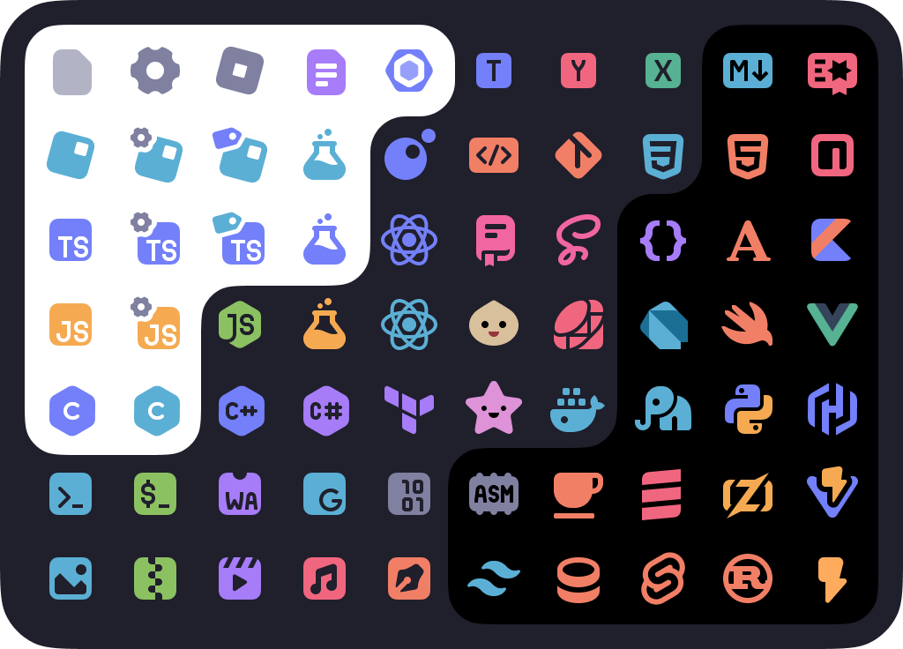
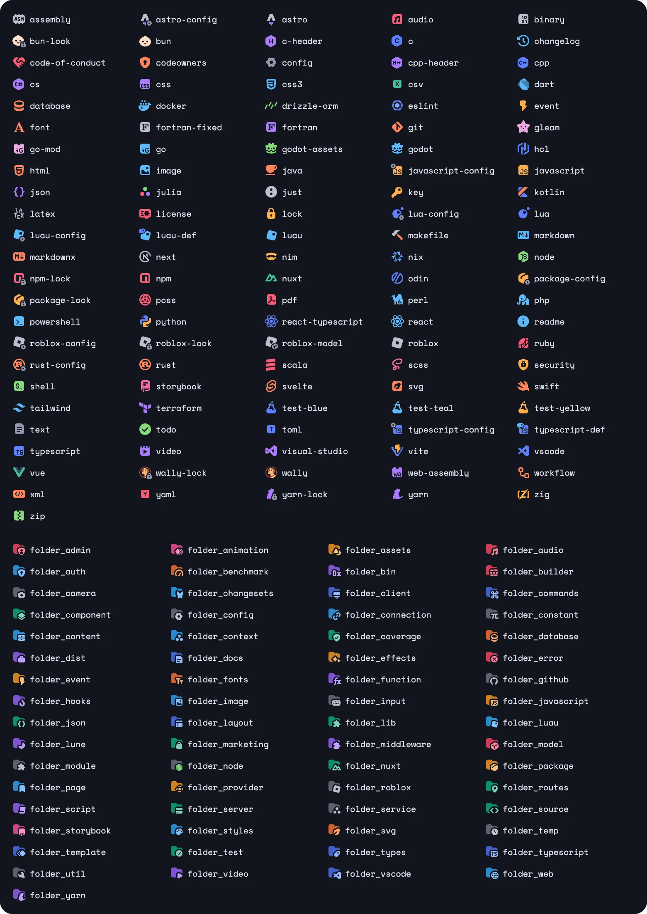
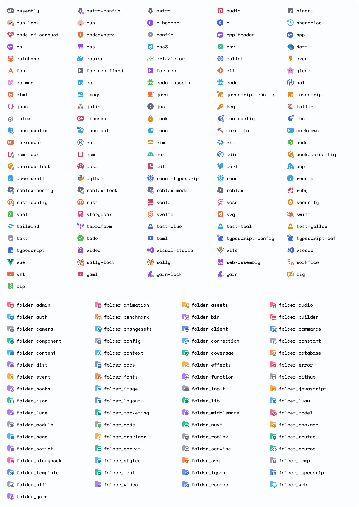
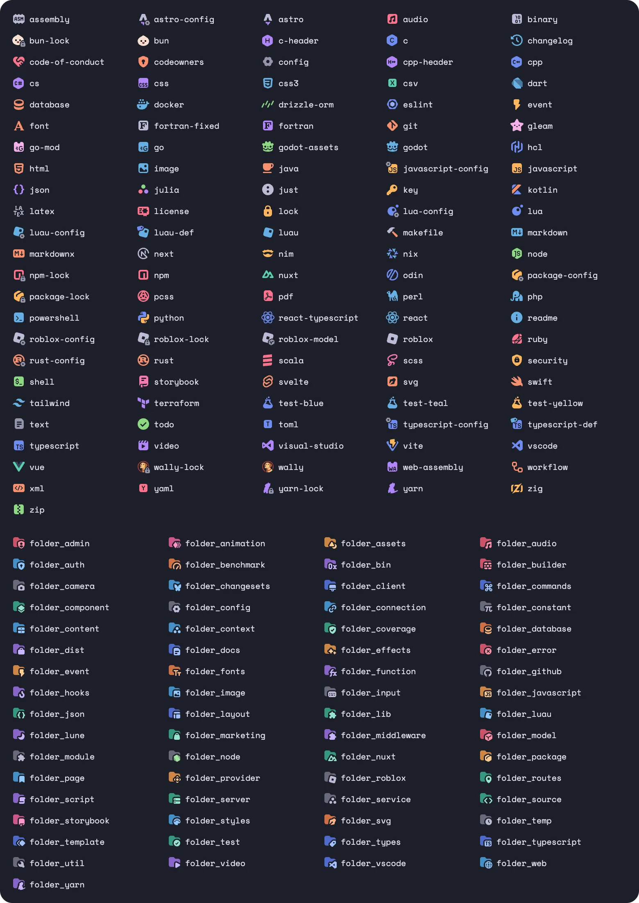
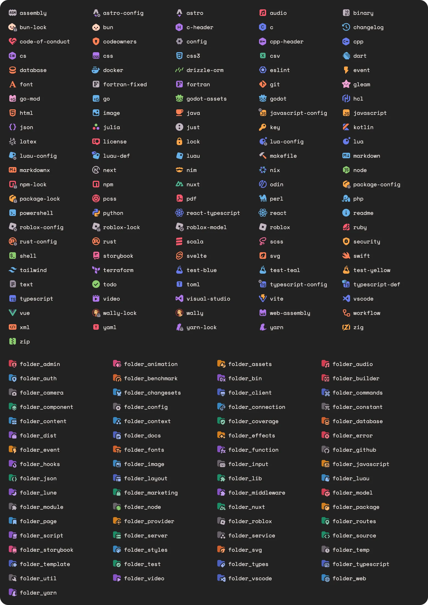

<p align="center">
  <h1 align="center"><b>Charmed Icons</b></h1>
  <p align="center"><b>fork by jmesrje, icons by littensy</b></p>
</p>

<div align="center">

[](LICENSE)




</div>

## 📷 Previews

<details>
  <summary>🫐 Base</summary>
  
</details>
<details>
  <summary>🥥 Light</summary>
  
</details>
<details>
  <summary>🍇 Soft</summary>
  
</details>
<details>
  <summary>🍓 Warm</summary>
  
</details>

## 🔧 Usage

### Marketplace Install

You can find my icons on the [Zed Marketplace](https://zed.dev/extensions?query=Charmed+Icons).

### Manual Install

1. Download the `zip` file from the [Releases](https://github.com/jmesrje/zed-charmed-icons/releases) page.
2. Open the extensions tab (`Ctrl+Shift+X`) in Zed.
3. Choose `Install Dev Extension` and select the unzipped release.
4. Open the settings tab (`Ctrl+,`) and add the following:

```json
{
    "icon_theme": "Base Charmed Icons"
}
```

### Icon Types

There a 4 sets of icons available: Base, Light, Soft, and Warm. These can be chosen in the icon theme selector menu or set manually in your config file.

## 🙌 Requests (original repository)

If you have any icon requests, please [open an issue](https://github.com/littensy/charmed-icons/issues/new).

Ping me on Discord `@littensy` for a quicker response!!

## ❤️ Gratitude

Charmed Icons draws inspiration from:

- [Catppuccin Icons](https://github.com/catppuccin/vscode-icons): Soothing pastel icons for VSCode.
- [Monospace Theme](https://github.com/keksiqc/monospace-theme): The Monospace Theme from Google's IDX.

---

<p align="center">
Charmed Icons is released under the <a href="LICENSE">MIT License</a>.
</p>

<div align="center">

[](LICENSE)

</div>
